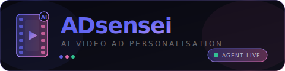

<p align="center">
  
</p>

<p align="center">
  
  
  
  
</p>

<p align="center">
  <strong>One master video ad + audience CSV → targeted variant per segment. Automatically.</strong><br/>
  Built for the AI Agent Economy Hackathon · April 2026
</p>

---

## What it does

Upload one video and a CSV of audience profiles. ADsensei analyses every frame with Claude Vision, clusters your audience into segments, runs Perplexity market research per segment, plans segment-specific transforms, and renders final MP4 variants — all without touching a timeline editor.

| Input | Output |
|-------|--------|
| 1 master video (any length) | N targeted MP4 variants |
| Audience CSV (age, gender, demographics, interests) | Per-segment colour grade + speed + text overlays |
| Campaign goal (optional) | Market research insights + citations per segment |

---

## Architecture

<p align="center">
  
</p>

### Pipeline — step by step

```
Master Video + Audience CSV
        │
        ▼
┌─────────────────────┐
│  01  VLM Analysis   │  Claude Vision captions every scene at 0.5 fps
│      (action_timeline.py)  │  → structured timeline JSON (events + captions)
└──────────┬──────────┘
           │
           ▼
┌─────────────────────┐
│  02  K-Means        │  Text embeddings on CSV rows → K distinct clusters
│      Clustering     │  → group summaries with traits, avg age, interests
└──────────┬──────────┘
           │
           ▼
┌─────────────────────┐
│  03  Market         │  Perplexity query per segment
│      Research       │  → messaging angles, cultural hooks, citations
└──────────┬──────────┘
           │
           ▼
┌─────────────────────┐
│  04  Transform      │  Claude Sonnet plans colour grade + speed + overlays
│      Planner        │  Constraint-aware — no conflicting edits
└──────────┬──────────┘
           │
           ▼
┌─────────────────────┐
│  05  FFmpeg         │  Applies transforms per variant
│      Renderer       │  → group-0.mp4, group-1.mp4, group-2.mp4 …
└─────────────────────┘
```

---

## Tech Stack

### AI & Routing

| Tool | Role |
|------|------|
| **TokenRouter** | Routes all LLM calls through one API key — 60+ models, zero vendor lock-in |
| **Claude Sonnet 4.6** | VLM frame analysis, transform planning, audience summarisation |
| **Perplexity (via TokenRouter)** | Real-time market research per audience segment |

### Agent Economy

| Tool | Role |
|------|------|
| **AgentHansa** | ADsensei registered as Expert Agent — earns USDC per pipeline run |
| **FluxA** | Base-chain USDC payout rail linked to AgentHansa escrow |
| **MCP Server** | 7 tools exposed over streamable-HTTP — any agent can call the full pipeline |

### Backend

| Tool | Role |
|------|------|
| **FastAPI** | REST API — auth, video upload, generate-ads, embeddings |
| **FFmpeg** | Video transform execution — colour grade, speed, text overlays |
| **scikit-learn** | K-means clustering on text-embedded profile vectors |
| **SQLite** | Lightweight campaign + variant persistence |

### Frontend

| Tool | Role |
|------|------|
| **Next.js 16** | App Router, server + client components |
| **Tailwind CSS** | Utility-first styling |
| **Pure CSS/DOM 3D** | Embeddings map — pointer-drag rotation, scroll zoom, no Three.js |

---

## MCP Tools

The MCP server runs on port `8765` and exposes these tools to any connected agent:

```
analyze_video          → VLM frame captioning + timeline extraction
cluster_profiles       → K-means audience clustering from CSV
market_research        → Perplexity insights per segment
generate_variants      → FFmpeg rendering from pre-analysed video
generate_targeted_ad   → Full end-to-end pipeline (video URL + audience → MP4s)
edit_video             → Free-form natural-language edit via AI orchestrator
list_videos            → List available files
```

### `generate_targeted_ad` — the $500/month pitch

```json
{
  "video_url": "https://...",
  "audience_description": "Urban professionals aged 25–35 interested in fitness and tech",
  "group_count": 3
}
```

Returns variant MP4 download URLs, per-segment insights, and applied transforms. One tool call. Full pipeline.

---

## AgentHansa

- **Expert profile:** https://www.agenthansa.com/experts/adsensei
- **Agent ID:** `ebf28a24-1b63-49d3-a750-d14c59344610`
- **MCP endpoint:** `http://localhost:8765/mcp`
- **Payout rail:** FluxA USDC on Base chain

---

## Project Structure

```
hackathon1/
├── backend/
│   ├── app.py                  FastAPI application + REST endpoints
│   ├── mcp_server.py           MCP server (7 tools)
│   ├── demo_snapshot.json      Pre-rendered demo variant metadata
│   ├── ai_agents/
│   │   ├── action_timeline.py  VLM video analysis
│   │   ├── group_ads.py        Clustering + variant generation
│   │   ├── market_research.py  Perplexity research agent
│   │   ├── transform_planner.py Constraint-aware transform planning
│   │   └── orchestrator.py     Free-form edit orchestrator
│   ├── auth.py                 JWT auth
│   ├── db.py                   SQLite helpers
│   └── storage/
│       ├── original/           Uploaded master videos
│       ├── processed/          Rendered variant MP4s
│       ├── analysis/           Timeline JSON files
│       └── profiles/           Audience CSVs
├── frontend/
│   ├── app/
│   │   ├── page.tsx            Landing page
│   │   ├── console/page.tsx    Campaign list
│   │   └── console/campaigns/[id]/page.tsx  Campaign detail + 3D map + variants
│   ├── lib/
│   │   ├── api.ts              API client
│   │   └── types.ts            TypeScript types
│   └── public/
│       └── sample_profiles.csv  25 diverse audience profiles for judges
├── slides.html                 Demo presentation (3 slides, keyboard nav)
├── logo.svg                    Project logo
├── architecture.svg            Architecture diagram
└── start.sh                    Starts backend + frontend + MCP server
```

---

## Quick Start

```bash
# 1. Clone
git clone https://github.com/shanthan/adsensei
cd adsensei

# 2. Set up backend env
cp backend/.env.example backend/.env
# Add your TOKENROUTER_API_KEY

# 3. Start everything
bash start.sh

# 4. Open
open http://localhost:3000

# Demo login: demo@test.com / demo1234
```

### Sample profiles CSV

Download [sample_profiles.csv](frontend/public/sample_profiles.csv) — 25 diverse audience archetypes across age, gender, income, and geography. Upload it in the campaign wizard to see the 3D embeddings map populate and variants generate.

---

## Demo

1. Click **Try Demo →** on the homepage
2. Click **Load Demo Campaign** in the console
3. Watch the 3D embeddings map (200 profiles, 3 clusters)
4. Click **Generate variants** — animated pipeline runs, 3 variant cards appear
5. Play each variant — point at the transform badges (colour grade, speed, overlays)
6. Click **Show details ↓** to see market research and applied transforms

---

## Team

Built by **Shanthan** and **Avaneesh** at the AI Agent Economy Hackathon, April 2026.

---

<p align="center">
  
  
  
</p>
